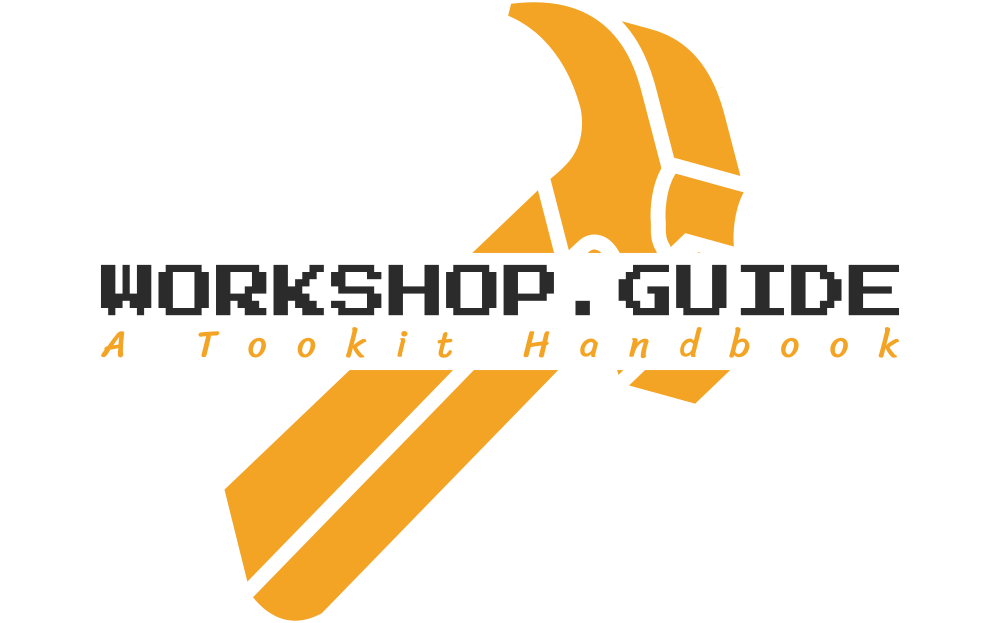

_This project is the source code of **workshop.guide**._ 

**workshop.guide** is a [nextra](https://nextra.vercel.app/) powered, no-code doc site. 

It maintains a notebook which records different kinds of tools that are often used in [@ri1ken](https://github.com/Kiotlin)'s programmer life.

---

Created by [@ri1ken](https://github.com/Kiotlin) at [Vercel](https://vercel.com). Released under the MIT license.